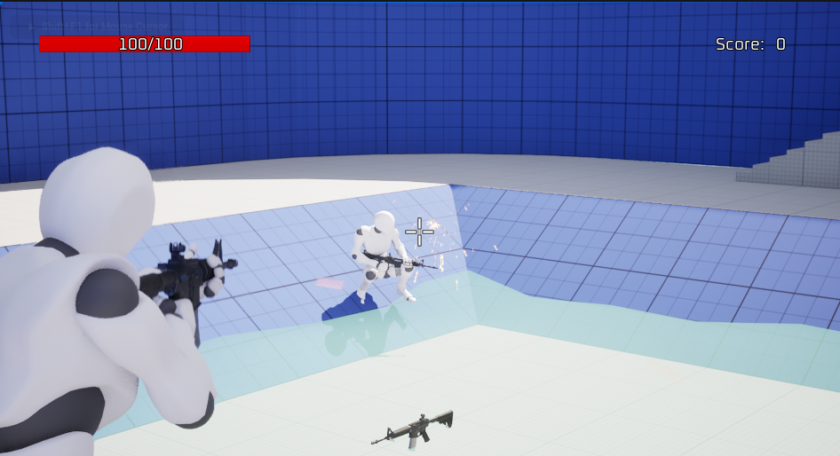

# Multiplayer Shooter Course
This repository tracks my progress through the Multiplayer Shooter course available [here](https://www.udemy.com/course/unreal-engine-5-cpp-multiplayer-shooter/).

Topics covered:

- Hosting sessions through Steam API
- Replication
- Architecture for a Third-Person Shooter game

## Compatibilty
This project was made in Unreal Engine 5.4.4

## Screenshot

